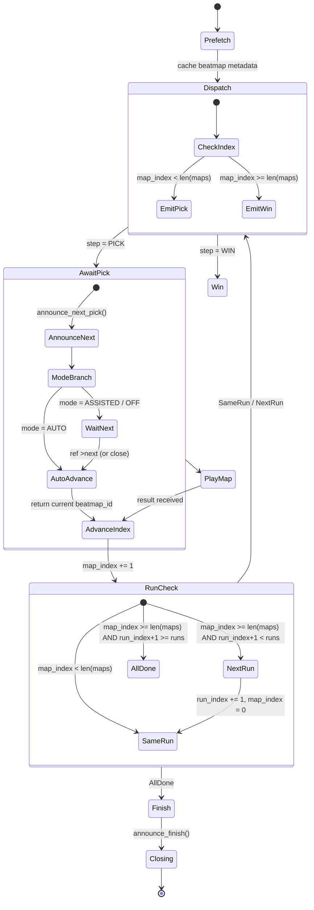
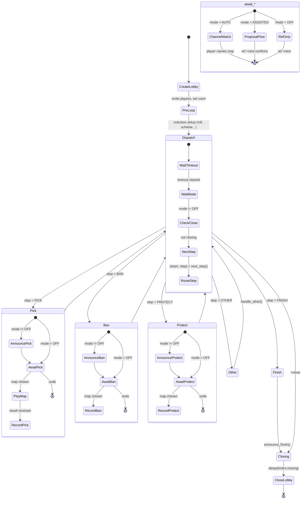
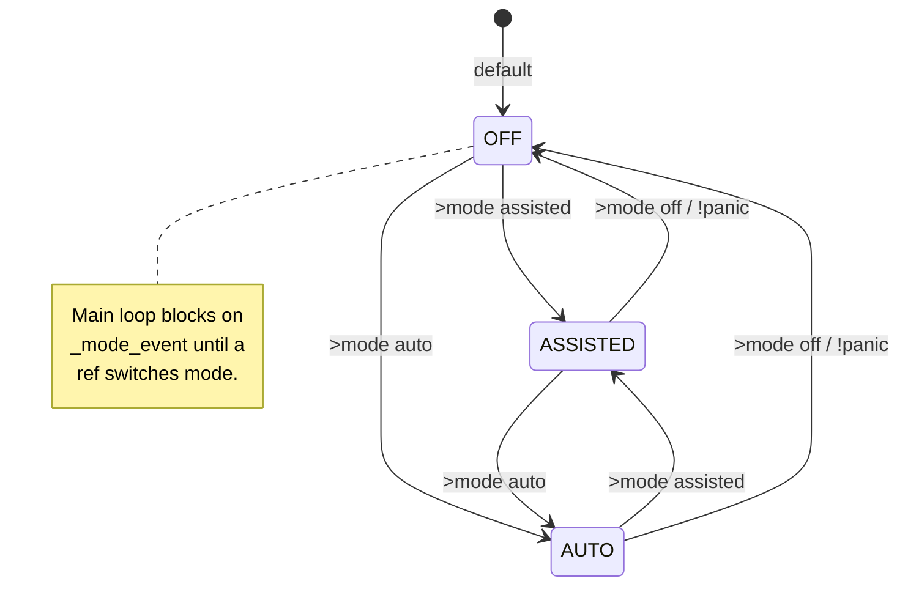

# AutoRef

AutoRef is an IRC-based osu! tournament referee bot. It manages pick/ban/protect sequences, qualifiers pools, and timers — with an optional web dashboard. Access the web interface at `/` when the web server is running.

## Quick Start

1. Start the web server: `python server.py`
2. Navigate to `http://localhost:8080`
3. Create a match using the quick-start form
4. Join the match and use ref commands to drive it

Or run directly from Python:

```python
from autoref import BracketAutoRef, Match, Pool, PlayableMap, Ruleset, Team
from autoref import WinCondition, RefMode
import bancho, asyncio

ar = BracketAutoRef(client, match, "QF: Blue vs Red", mode=RefMode.AUTO)
asyncio.run(ar.run())
```

See `run_bracket.py` and `run_qualifiers.py` for full working examples.

## Features

### Ref Modes

Three modes control how much the bot drives the match:

**auto**
- Fully automatic
- Bot announces each step, starts timers, and advances when a player names a map in chat
- In bracket matches, pick timer expires and passes to the other team if no choice is made

**assisted**
- Bot watches for player map choices and surfaces them as proposals in the web UI
- A ref confirms each step with `>next <map>` or via the web banner
- Ref can change the proposed map before confirming

**off**
- Bot is silent
- Ref drives everything manually with ref commands

Switch modes at any time with `>mode <off|assisted|auto>`. Any player can type `!panic` to instantly switch to `off`.

### Ref Commands

All commands are prefixed with `>`. Commands marked *(anyone)* can be used by any player in the lobby.

**Flow**
- `>undo` / `>u` — undo the last pick/ban/protect and repeat the step
- `>abort` / `>ab` — abort the current map and replay it
- `>dismiss` — discard a pending assisted-mode proposal
- `>close` — end the match and save to the database
- `>close force` — end the match without saving

**Mode**
- `>mode auto` — switch to auto mode
- `>mode assisted` — switch to assisted mode
- `>mode off` — switch to off mode
- `!panic` — instant switch to off mode *(anyone)*

**Timers**
- `>timeout [secs]` — start a break timer, default 120s *(anyone)*
- `>timer <secs|pick|ban|protect|between|ready|force|closing>` — start a named or custom timer
- `>startmap [delay]` — force-start the current map

**Lobby**
- `>setmap <beatmap_id>` / `>sm` — change the room map
- `>invite` / `>inv` — re-invite all players
- `>refresh` / `>rf` — fetch `!mp settings` and update player state
- `>next <map>` — confirm the next step (assisted/off mode)

**Info**
- `>status` / `>st` — full match status *(anyone)*
- `>scoreline` / `>sc` — current score only *(anyone)*
- `>picks` / `>pk` — pick history *(anyone)*
- `>bans` / `>bn` — ban history *(anyone)*
- `>protects` / `>prot` — protect history *(anyone)*

### Bracket Matches

`BracketAutoRef` runs the standard bracket flow: Roll → Order → Protect → Ban → Pick → Tiebreaker → Done.

**Roll phase**
- All team captains `!roll`
- Bot collects results and ranks teams by roll value (highest = rank 0)
- Ref can override with `>roll <team1> <team2>`
- Times out after 120s; partial results are used if available

**Order phase**
- If multiple `OrderScheme`s are configured, the roll winner chooses one with `>order <n>`
- Skipped automatically when only one scheme is defined

**Protect / Ban / Pick**
- Sequence is determined by the chosen `OrderScheme`
- Default ban pattern is ABBA for 2-team matches
- Picks alternate starting from `scheme.pick_first`
- Split bans (`split_ban_after_pick`) run half the bans before picks and the other half after a configurable pick threshold

**Tiebreaker**
- Triggers when both teams reach `wins_needed - 1`
- The tiebreaker map is unlocked and played automatically
- The loser of the last map picks first; falls back to rank-0 team if no prior map

**Bracket-only commands**
- `>roll <team> [team…]` — set roll ranking manually
- `>order <n>` — choose an order scheme
- `>phase` — show current phase and cursors
- `>fp <team>` — set who picks first
- `>fb <team>` — set who bans first
- `>fpro <team>` — set who protects first
- `>setscoreline <s0> <s1>` / `>ssl` — override map win counts directly

### Qualifiers Matches

`QualifiersAutoRef` plays every map in pool order sequentially. No picks, bans, or protects.

- Supports multiple runs (`runs=N`) — the pool loops N times
- In `assisted`/`off` mode, the ref advances to the next map with `>next`
- The web dashboard shows maps played, maps remaining, and an ETA based on beatmap lengths

**State diagram**



Notes:
- `next_step()` is stateless: it just compares `_map_index` against the pool length.
- `await_pick()` returns the predetermined map ID rather than waiting on chat — there is no pick timer (`_pre_pick` skips `lobby.timer`).
- `>close` aborts the wait in `ASSISTED`/`OFF` mode by setting `_close_event`.

## Workflow Examples

### Running a Bracket Match (Auto Mode)

1. Build a pool and save it in the pool builder
2. Create a match from the web landing page, select the pool, set mode to **auto**
3. Players join and `!roll`
4. Bot announces the roll winner and prompts for scheme selection if needed
5. Protect/ban/pick sequence runs automatically
6. Bot announces the winner and closes the lobby

### Running a Match with Assisted Mode

1. Create a match with mode set to **assisted**
2. Players join and `!roll`
3. When it's a team's turn to pick, a player names a map in chat
4. The web UI shows a proposal banner — confirm with **✓ confirm** or change the map
5. Bot sets the map and starts the game

### Recovering from a Mistake

1. Type `>undo` or click undo in the web UI
2. The last pick/ban/protect is reversed and the map returns to pickable
3. The step repeats from the beginning

### Running Qualifiers

1. Build a pool with all qualifier maps
2. Create a qualifiers match from the web form
3. Players join; bot announces the first map
4. After each map finishes, bot announces the next
5. Use `>close` when done to save scores

## Technical Details

### Main Loop State Diagram

The abstract `AutoRef.run()` loop, after `_pre_loop()` setup, dispatches steps returned by the subclass's `next_step()`. Picks, bans, and protects each go through their own await path depending on the active mode.



**Mode transitions** apply at any point in the loop:



### Data Models

**Pool**

Pools are trees of `Pool` and `PlayableMap` nodes. `ModdedPool` applies mods to all child maps automatically.

```python
pool = Pool("Tournament Pool",
    ModdedPool("HD", Mods("HD"),
        PlayableMap(3814680, name="HD1"),
        PlayableMap(3814681, name="HD2"),
    ),
    Pool("NM",
        PlayableMap(3814682, name="NM1"),
    ),
)
```

**Ruleset**

```python
ruleset = Ruleset(
    vs=4,                                        # players per team
    gamemode=aiosu.models.Gamemode.STANDARD,
    win_condition=WinCondition.SCORE_V2,
    enforced_mods="NF",
    team_mode=2,                                 # 2 = TeamVs, 0 = HeadToHead
    best_of=11,
    bans_per_team=2,
    protects_per_team=1,
)
```

**Timers**

All values are in seconds. Defaults:

| Timer | Default | Description |
|---|---|---|
| `pick` | 120 | Time to name a map |
| `ban` | 120 | Time to ban a map |
| `protect` | 120 | Time to protect a map |
| `ready_up` | 90 | `!mp timer` window for players to ready up after the map is set |
| `force_start` | 10 | Delay used by `>startmap` for manual starts |
| `between_maps` | 5 | Buffer after a map ends, before the bot moves on |
| `closing` | 30 | Delay between win announcement and lobby close |

### Win Conditions

- `SCORE_V2` — ScoreV2 (default)
- `SCORE_V1` — Classic score
- `ACCURACY` — Accuracy percentage
- `COMBO` — Max combo
- `FEWER_MISSES` — Custom: fewer misses wins
- `TARGET_SCORE` — Custom: first to reach a score
- `TARGET_ACCURACY` — Custom: first to reach an accuracy

### Storage

Matches are persisted to a SQLite database (`matches.db` by default, override with `$AUTOREF_DB`).

Tables:
- `matches` — ruleset metadata and winner
- `match_teams` — team names per match
- `match_actions` — every pick/ban/protect with timestamp
- `game_scores` — per-player scores enriched from the osu! API

### Score Enrichment

`ScoreFetcher` polls the osu! match endpoint after each map and stores per-player data in `game_scores`:
- Score, accuracy, max combo
- Mods used
- Pass/fail
- Rank (S, A, B, etc.)

This data feeds the stats page leaderboards.

### API Endpoints

- `GET /api/matches` — list all active and pending matches
- `POST /api/matches` — create a pending match
- `POST /api/matches/{match_id}/start` — start a pending match
- `DELETE /api/matches/{match_id}` — close or cancel a match
- `GET /api/stats` — leaderboard and mappool stats (see [stats.md](stats.md))
- `GET /api/pools` — list saved pools (see [pool-builder.md](pool-builder.md))
